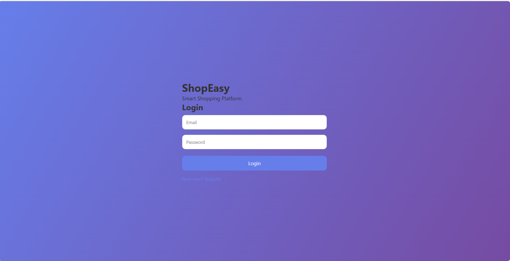

A real-time video conferencing and collaboration web application built using WebRTC, Socket.io, Express.js, and JavaScript.

## Features
- Video calling
- Screen sharing
- File sharing
- Whiteboard collaboration

## 📸 Screenshot


## Run Project
```bash
npm install
npm start
